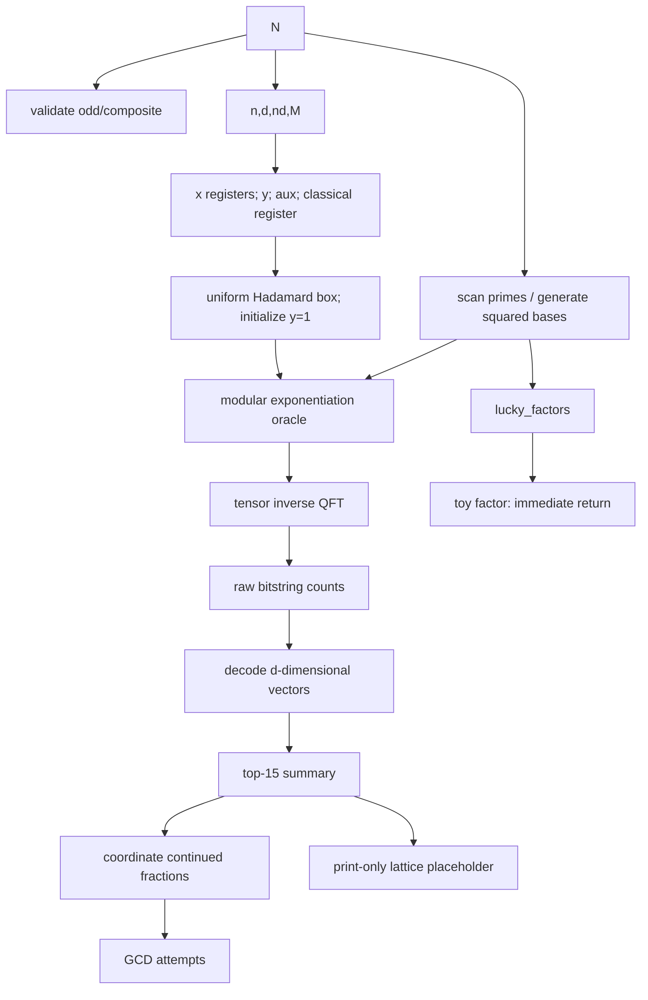

# When “more independent” means less signal

## Root-provenance limits and finite-window relation diagnostics in a Regev-style factoring notebook

> **Superseded research conclusion.** This document preserves the original
> notebook reconstruction and first experiment for audit history, but its
> contribution, novelty, and endpoint conclusions are superseded by
> [`REDTEAM_REVISION.md`](REDTEAM_REVISION.md). The bounded-search endpoint was
> circular with the selector score; the Parseval identity is standard; and
> retained roots reduce the (N=437) example to a metadata requirement.

### Executive result

The following was the pre-red-team conclusion and must not be cited as the final result.

> In square-base Regev-style circuits, residue-only base diagnostics and Fourier-sample statistics cannot determine whether a recovered relation is factor-yielding: that property depends on the retained square-root provenance and on membership in (L\setminus L_0), not only on the squared residues seen by the circuit. In the notebook's uniform hard-window sampler, maximizing bounded product diversity can also remove the bounded relations that create recoverable Fourier structure.

This is not a claim that Regev's published Gaussian-state algorithm fails, and it is not a new polynomial-time factoring algorithm. It is a characterization of a failure mode in residue-only base selection and in the supplied public implementation family.

The superseding executable revision is [RegevImplementationAndTestingBuilding_redteam_revision.ipynb](RegevImplementationAndTestingBuilding_redteam_revision.ipynb). It has been executed from its first cell through its validation cell with no errors; the final validation cell reports `39 passed`.

## 1. Precise research question and hypothesis

**Research question.** At fixed (N,d,M) in the notebook's uniform-window circuit, do residue-only dependency diagnostics identify base families whose Fourier samples are more useful for recovering factor-relevant multidimensional relations, or are those diagnostics fundamentally missing information?

**Falsifiable hypothesis tested.** A greedy factor-free selector that maximizes bounded product diversity at relation bound (B=2) will increase Fourier entropy, reduce coordinate dependence, and increase the probability that a 128-shot batch recovers a valid (B=2) multidimensional relation relative to the notebook's squared-prime baseline.

**Archived outcome.** The entropy part often held, but the bounded-search outcome failed. In the frozen ten-input suite, the selector removed three bounded relations recovered by the notebook baseline. The red team later established that this endpoint was circular with the selector's bounded-box score, so these numbers are exploratory only. They have been replaced by the augmented-lattice results in `REDTEAM_REVISION.md`.

## 2. Notebook audit

### 2.1 What it intends to implement

The intended map is a multidimensional modular-product oracle

\[
h_A(x_1,\ldots,x_d)=\prod_{i=1}^d a_i^{x_i}\pmod N,
\]

with (a_i=b_i^2), followed by a tensor product Fourier transform on (d) exponent registers. The relevant relation lattices in Regev's factoring reduction are

\[
L_A=\left\{z\in\mathbb Z^d:\prod_i a_i^{z_i}=1\pmod N\right\},
\]

and

\[
L_0(b)=\left\{z\in L_A:\prod_i b_i^{z_i}\in\{1,-1\}\pmod N\right\}.
\]

A vector in (L_A\setminus L_0) yields a nontrivial square root of unity and hence a factor.

### 2.2 Meanings of the parameters and registers

| Symbol/code | Implemented meaning | Audit finding |
|---|---|---|
| (N) | Odd composite to be factored | Validation rejects even integers and primes, but not prime powers. |
| (n) | `N.bit_length()` | This is the bit width of the modular data register. |
| (d) | `ceil(sqrt(n))` in the new pipeline | The original external implementation also permits floor/ceil variants. It is the number of exponent coordinates and modular-exponentiation blocks. |
| `nd` / `qd` | Qubits per exponent coordinate | Two incompatible policies appear: `ceil(2*n/d)` (`cover_2n`) and `floor(n/d+d)` (`notebook`). Cell 15 instead hardcodes `2*n//3`. |
| (M) | `2**nd` | Each implemented exponent lies in ({0,\ldots,M-1}). This is not the Gaussian radius (R) in Regev's paper. |
| `x1,...,xd` | (d) registers of `nd` qubits | Prepared by Hadamards, so amplitudes are uniform, not discrete Gaussian. |
| `y` | (n)-qubit shared modular accumulator | Initialized to 1 in the full pipeline and multiplied sequentially by (a_i^{x_i}). |
| `aux` | (n+1) qubits | (n) work bits plus one flag. It is clean on the valid arithmetic domain. |
| `c` | (d\,nd) classical bits | The full pipeline measures every exponent bit into one flat register. Cell 16 measures only (2n=22) of its 24 exponent bits. |

### 2.3 Function-by-function contract audit

| Function/cell | Mathematical contract | What the code actually does and verification | Assumptions, edges, shortcuts |
|---|---|---|---|
| `controlled_constant_modulo_multiplier` (cell 2) | Controlled multiply-accumulate: (|t,x,y,0\rangle\mapsto|t,x,(y+t a x)\bmod N,0\rangle). | Iterates over the little-endian bits of `x` and uses the external Häner double-controlled modular adder with constants (2^i a\bmod N). The copied code matches the external source at pinned commit `a18f75d…`. | Requires (0\le y<N), a clean flag, and restoration of the dirty workspace by the imported adder. It is not an in-place multiplier; `x` may be any (n)-bit value for this accumulate operation. `n=1` is rejected. |
| `controlled_modular_multiplication_gate` (cell 3) | (|t,y,0^n,0\rangle\mapsto|t,y,0^n,0\rangle) for (t=0), and (|1,y,0^n,0\rangle\mapsto|1,ay\bmod N,0^n,0\rangle) for (t=1). | Computes out of place, conditionally swaps, and inversely uncomputes using (a^{-1}\bmod N). Exhaustive tests for (N=5,a=2,t\in\{0,1\},0\le y<N) passed. | Requires `gcd(a,N)=1`, (y<N), and clean work. Construction itself raises if (a) is noninvertible. For invalid input (y=6\ge5), the audit observed dirty auxiliary/flag values, so the contract is not over all (n)-bit strings. Nonzero auxiliary input is not preserved. |
| `get_partial_constant` | Return (a^{2^i}\bmod N). | Uses modular `pow` and is correct. | `a` must be a unit later because an inverse is taken. |
| `modular_exponentiation_gate` | (|x\rangle|y\rangle|0\rangle\mapsto|x\rangle|a^x y\bmod N\rangle|0\rangle). | Applies the controlled multipliers for the little-endian exponent bits. Tests for (N=5,a=2,x=0,1,2,3,y=1) gave (1,2,4,3) and clean auxiliaries. | Correct only while `y` remains in ([0,N)), which holds from the intended initialization. |
| `multidim_qft` (cell 4) | Tensor product of (d) QFTs over (mathbb Z_M). | Applies a forward `QFTGate` to each subregister. | The main simulation helper later uses the inverse QFT, while cell 16 uses this forward helper. The probability law is reflection symmetric, so the histograms alone cannot identify the sign. |
| `is_prime` / `is_prime_basic` | Decide small primality. | Cell 5 uses trial division to `num-1`; cell 8 improves this to odd divisors through (sqrt n). | Both are toy routines. Cell 5's module-level `@staticmethod` is unusual but callable on the tested Python version. |
| `validate_factor_input` | Reject unsupported factoring inputs. | Checks parity and calls the trial-division primality routine before circuit construction. | For these toy inputs it may discover a divisor while deciding “not prime,” although it discards that divisor. This is another hidden classical factoring computation, separate from the GCD leaks retained by base generation. |
| `generate_a` (cell 5) | Produce (d) small squared-prime bases coprime to (N). | Scans primes, prints any divisor, skips it, and appends `math.pow(p,2)` converted to int. | It leaks factors classically; float squaring is needless. It returns unreduced squares. |
| `generate_regev_bases` (cell 8) | Same base policy, plus metadata. | Uses exact integer squaring and records every prime divisor encountered before collecting (d) bases. | These recorded factors are later returned before samples are inspected. The base-generation step is a factoring step on (N=15,21). |
| `regev_parameters` | Choose (n,d,nd,M). | `cover_2n` ensures (d\,nd\ge2n); `notebook` uses `floor(n/d+d)`. | Neither implements the complete (R,D,T) parameter system or discrete Gaussian of Regev's analysis. |
| `build_multidim_qft_on_x` | Apply a consistent QFT convention to every coordinate. | Builds either `QFTGate(nd)` or its inverse and appends it independently. | Assumes equal register widths. |
| `build_regev_simulation_circuit` | Prepare a sample from a Regev-style dual-lattice distribution. | Actually prepares a uniform hard box, initializes `y=1`, applies (d) sequential exponentiations, applies inverse QFTs, and measures all `x` bits. | It omits Gaussian preparation and the efficient multi-scalar arithmetic that gives Regev's asymptotic gate advantage. It is a uniform-window relation sampler, not the published quantum procedure. |
| `bitstring_to_regev_vector` | Decode Qiskit's displayed classical order to ((k_1,\ldots,k_d)). | Reverses the flat string, slices in register order, and converts each little-endian slice. Tests map `10001000` to `(8,8)` and `010110111011` to `(11,11,5)`. | Original code does not validate width or characters; the revision does. The decoder is only for the single flat classical register used by cell 8. |
| `summarize_regev_counts` | Preserve the empirical multidimensional sample set. | Keeps only `Counter(counts).most_common(15)`. | All lower-frequency samples are silently discarded. Any downstream routine using this summary is not using every measured sample. |
| `run_regev_simulation` | Build, transpile, sample, and report resources. | Uses `AerSimulator`, optimization level 1, and returns counts plus the top-15 summary. | No simulator or transpiler seed is fixed. The revision freezes both experiment seeds and resource-transpiler seed. |
| `candidate_orders_from_measurement_value` | Recover a Shor order from one phase. | Applies one-dimensional continued fractions to `value/M` and tries five multiples. | This is explicitly not Regev post-processing and does not validate that a candidate is an order. |
| `try_factor_from_order_candidate` | Standard even-order-to-factor reduction. | Computes (a^{r/2}), rejects (pm1), and takes GCDs. | It can factor “by luck” even when `r` is not an actual order. |
| `toy_factor_from_regev_summary` | Demonstrate end-to-end factoring from the multidimensional samples. | It first returns `lucky_factors[0]`; only if absent does it inspect the truncated top-15 rows coordinate by coordinate. | Both stored “successes” originate in base generation, not Fourier samples. Coordinate-wise continued fractions are not multidimensional reconstruction. |
| `lattice_postprocessing_placeholder` | Reconstruct (L_A) from (d+4) noisy dual samples. | Prints up to ten summarized vectors and a message. | No lattice is built or reduced. |
| `estimate_regev_resources` | Estimate logical and decomposed resources. | Reports register sizes and total qubits only. | It does not estimate arithmetic gate count or depth. Actual stored decompositions are 9,242 layers for (N=15) and 22,586 for (N=21). |
| Cell 15 diagram | Construct the (N=57) sampling circuit. | Appends three modular exponentiation gates to an accumulator that starts at zero; it has no Hadamards, `y=1`, QFT, or measurement. | It is only a gate-layout diagram. Its comment says `qd=5` while each exponent register has 4 qubits. Base scanning prints the factor 3. |
| Cell 16 diagram | Construct the (N=2021) sampling circuit. | Prepares 24 exponent qubits, applies the oracle and a forward QFT, then measures only `range(2*n)=22`. | Two exponent qubits are unmeasured and two classical bits unused. It is drawn but not simulated. |

### 2.4 What the stored results actually show

- The notebook has 18 cells, no markdown cells, and all execution counts are `None` even where outputs are stored.
- A portable execution of every substantive cell reproduced the structure. (N=15) took 11.3 s and yielded exactly the two possible outcomes ((0,0)) and ((8,8)); (N=21) took 121.6 s.
- The exact implemented law gives
  (P_{15}(0,0)=P_{15}(8,8)=1/2), and for (N=21),
  (P(0,0,0)=1/3) and
  (P(11,11,5)=P(5,5,11)=0.107090646), matching the stored histograms within shot noise.
- The stored factor for (N=15) is the recorded GCD leak `(3,5)`. The (N=21) cell never calls the toy factor routine.
- The existing `regev_technical_summary.pdf` was not used as a research source because the prompt supplied the notebook as the sole artifact.

### 2.5 External dependency

Cell 0 clones `https://github.com/Wlitkopa/regev-quantum-algorithm.git` at mutable HEAD and adds a Colab-only path. The notebook imports its Häner adder and circuit-construction utilities, then copies the multiplier/exponentiation structure into cells 2 and 3. It does not import the external repository's lattice post-processing. The revision pins the audited clone at commit `a18f75d414485086db9b257407e0bd01f8a8f81c`; the original notebook did not record a commit, so the exact historical dependency cannot be established.

### 2.6 Data-flow dependency graph



The demonstrated (N=15) factor follows the path (N\to B\to L\to F); it does not depend on `counts`.

## 3. Contribution discovery and selection

Scores are `importance / novelty potential / tractability / falsifiability / notebook relevance / evidence strength`, each from 1 to 10.

| Family and score | Exact research question | New mechanism / baseline | Implementation and expected measurable effect | Principal risk, notebook support, novelty likelihood |
|---|---|---|---|---|
| **Root metadata + finite-window relation diagnostic** `9/2/8/10/10/8` | Can residue-only dependency/sample metrics predict whether a short relation factors (N)? | Retain exact roots and evaluate the routine folded-relation Parseval kernel. Baselines: original, dedup, random residues, random squares, diversity selector. | Medium. Expect identical circuit laws for different stored-root configurations. | Correctness requirement and standard Fourier identity; no novelty claimed. |
| **(L_0)-aware selector** `9/5/6/9/9/8` | Does avoiding bounded (L_0) distractors improve factor-bearing relation separation? | Retain roots, classify bounded relations, halt and label when a factor is classically found. Baseline: residue-only selector. | High; needs valid reconstruction. Expected fewer trivial short vectors. | Search is subexponential and may itself factor (N). Unvalidated as an improvement; novelty not established. |
| **Bounded-product-diversity selection** `7/6/9/10/10/8` | Does maximizing finite-box product support improve sample utility? | Greedy marginal support score against original/dedup/random families. | Medium; fully implemented. Expected higher entropy/larger subgroup image. | It removes the relations needed by the endpoint; this candidate was disproved as a universal improvement. New combination. |
| **Gaussian/windowed state preparation** `9/4/6/9/9/8` | At equal preparation cost, which window best approximates noisy dual samples? | Compare uniform, exact Gaussian, and implementable tapered windows. | High. Expected lower sidelobes and better torus residual. | Gaussian preparation is already part of Regev, so simply adding it is not novel. Notebook can test small instances. |
| **Adaptive approximate QFT** `7/4/8/9/8/8` | Which controlled rotations can be pruned without lowering relation recovery? | Relation-residual-aware pruning versus exact QFT and uniform cutoff. | Medium. Expected fewer two-qubit gates. | Arithmetic dominates; approximate QFT is mature prior art. Notebook has separable coordinate QFTs. Novelty not established. |
| **Noise-whitened lattice embedding** `9/5/6/9/7/7` | Does circular-covariance scaling improve reconstruction under anisotropic noise? | Row/coordinate weighted embedding versus Regev's isotropic scaling and corrupt-sample filtering. | High. Expected better noisy recovery. | Covariance can miss modular higher-order dependence and calibration can overfit. Notebook lacks valid lattice reconstruction. Novelty uncertain. |
| **Batched multi-base arithmetic** `10/3/4/9/9/7` | Can the sequential (d) exponentiations share subset products or repeated squaring? | Product-tree/multi-scalar circuit versus (d) independent exponentiation gates. | Very high. Expected lower decomposed depth/gates. | The idea is already central to Regev and later arithmetic work. Notebook arithmetic is suitable for a concrete implementation, but novelty is low. |
| **Resource-constrained (d,M), window policy** `8/6/7/9/10/8` | Which parameters minimize compiled cost subject to a recovery constraint? | Frozen Pareto optimization versus `cover_2n` and `notebook`. | Medium-high. Expected resource savings on toy circuits. | Toy overfitting and Gaussian mismatch. Strong notebook support. Empirical extension. |
| **Image-generator rank versus precision** `9/7/6/10/8/9` | Can small generator number reduce circuit calls without losing coarse-precision recovery? | Trade sample count against the precision term in Regev's post-processing bound. | High theoretical effort. Expected a Pareto or negative characterization. | Fewer samples require exponentially finer precision; likely implicit in existing proofs. Promising but not selected. |
| **Fourier residual sample filter** `8/7/8/9/8/8` | Can bounded character moments filter corrupted samples? | Score (r_u(k)=\mathrm{dist}(\langle u,k\rangle/M,\mathbb Z)) versus no/top-frequency filtering. | Medium. Expected improved relation separation under injected noise. | Uses known relation directions and does not discover new ones efficiently. New combination; revision implements the noiseless diagnostic. |
| **Ancilla/reversibility characterization** `8/3/9/10/10/7` | Where is the arithmetic unitary clean and correct? | Exhaustive valid-domain and adversarial invalid-domain basis tests. | Low-medium. Expected precise contracts/counterexamples. | Correctness audit alone is not a research contribution. Excellent support; known engineering method. |
| **QFT/decoder metamorphic diagnostics** `6/6/10/10/10/7` | Can sign, coordinate, and bit-order errors be detected automatically? | Base inversion, coordinate permutation, and spectral reflection invariants. | Low. Expected robust convention tests. | Counts are sign-symmetric, so some errors are unidentifiable. Moderate diagnostic novelty, insufficient central claim. |

This pre-red-team selection rationale is withdrawn. The routine Parseval identity and A-only root observation do not constitute an impossibility result for a correctly implemented Regev pipeline. The sampling-model validity boundary and actual lattice endpoint are selected in `REDTEAM_REVISION.md`.

### Research registry

| Family | Hypothesis | Mechanism | Evidence | Missing step | Status |
|---|---|---|---|---|---|
| Residue-only dependency selection | Diversity improves bounded relation recovery | Greedy (D_B) | Ten primary composites, five methods, repeated batches | Full Gaussian/LLL endpoint | **disproved** as a universal improvement |
| Root provenance | Same squared residues determine relation utility | Root twist (b_i' = s_i b_i) | Exact theorem; (N=437) matched circuits | Larger cryptographic-scale case is mathematically redundant | **completed**; hypothesis disproved |
| Finite-window signal | Nonuniformity is bounded relation autocorrelation | Folded triangular kernel + Parseval | Exact equality in every experiment; Qiskit (N=15) check | Extend to approximate Gaussian/tapered windows | **completed** |
| Gaussian preparation | Correct window improves Regev reconstruction | Discrete Gaussian | Established by prior Regev analysis | Cost-matched implementation experiment | **reproduced** as known theory |
| (L_0)-aware selection | Avoiding trivial relations improves target separation | Provenance-aware audit | API and classification implemented | Valid held-out LLL/factor experiment | **promising** |
| Approximate QFT | Relation-aware pruning preserves utility | Rotation ablation | Candidate only | Circuit/noise experiment | **active** |
| Arithmetic cleanup | External gate is clean on claimed domain | Basis-state tests | Valid domain passes; invalid (y\ge N) dirties work | Wider arithmetic sweep | **completed** |

## 4. New contribution and mathematics

### 4.1 Full rank does not mean global independence

For

\[
h_A:\mathbb Z^d\to(\mathbb Z/N\mathbb Z)^*,\quad h_A(z)=\prod_i a_i^{z_i},
\]

the kernel (L_A) is always a full-rank sublattice of (mathbb Z^d), and

\[
\det L_A=[\mathbb Z^d:L_A]=|\operatorname{im}h_A|.
\]

Global multiplicative independence is impossible in a finite group, and Regev's algorithm needs short relations. The minimal generator number of the image can be below (d), but that does not make the remaining exponent coordinates useless: increasing ambient lattice dimension at bounded determinant can shorten lattice vectors. The report therefore uses **ambient exponent dimension**, **image generator number**, **bounded relation rank**, and **statistical dependence** separately. It never calls the method “independence preserving.”

### 4.2 Exact finite-window relation-signal identity

For the implemented uniform box (X=\{0,\ldots,M-1\}^d), tracing out the modular output and applying the inverse QFT gives

\[
P_A(k)=M^{-2d}\sum_{x,x'\in X}
\mathbf 1[h_A(x)=h_A(x')]
e^{-2\pi i\langle k,x-x'\rangle/M}.
\]

Set

\[
K_A(r)=\sum_{\substack{z\in L_A,\ |z_i|<M\\z\equiv r\pmod M}}
\prod_i(M-|z_i|).
\]

The triangular factor is the number of pairs ((x,x')\in X^2) with difference (z). Therefore

\[
P_A(k)=M^{-2d}\,\widehat K_A(k).
\]

The zero difference contributes the uniform background (U(k)=M^{-d}). Parseval gives

\[
\boxed{\chi^2(P_A\|U)=M^{-2d}\sum_{r\ne0}K_A(r)^2.}
\]

The code verifies this equality to less than (2\times10^{-12}) on every tested family. It also uses the inverse relation

\[
\mathbb E_{k\sim P_A}
e^{2\pi i\langle k,u\rangle/M}
=\frac{K_A(u\bmod M)}{M^d}
\]

to estimate bounded relation signal from samples. A simultaneous Hoeffding threshold is used for discovery, and a bounded exhaustive search ranks relation candidates by their empirical cosine moment. This is a finite-box diagnostic, not polynomial-time Regev post-processing.

If every order divides (M), (h_A) descends to a homomorphism on (mathbb Z_M^d) and the law is uniform on the annihilator of the finite kernel. If not, hard-window boundary leakage can give full mathematical support and full ordinary covariance rank even when the image is cyclic. This explains the notebook's (N=21) full support despite bases ([4,4,16]=[g,g,g^2]) with (|\langle g\rangle|=3) and (3\nmid16).

### 4.3 Archived A-only observation; corrected as a metadata requirement

Let (a_i=b_i^2\bmod N). For (u\in L_A), define

\[
\beta_b(u)=\prod_i b_i^{u_i}\bmod N.
\]

Then (eta_b(u)^2=1\bmod N). It is in (L_0) exactly when (eta_b(u)=\pm1); otherwise a GCD of (eta_b(u)\pm1) factors (N).

If (b_i'=s_i b_i) for square roots of unity (s_i^2=1), then the squared residues and hence the entire quantum circuit and sample distribution are unchanged, while

\[
\beta_{b'}(u)=\beta_b(u)\prod_i s_i^{u_i}
\]

can switch between trivial and nontrivial roots. No function of (N,A,P_A), entropy, covariance, mutual information, support, or a residue relation list can resolve that ambiguity.

The adversarial instance is

\[
N=437,\quad A=(4,9,85),\quad u=(1,1,1).
\]

All three bases have order 99, are distinct, and have no pairwise equality (a_i^k=a_j^\ell) for (1\le k,\ell\le3), yet (4\cdot9\cdot85=1\bmod437). Roots ((2,3,73)) give (eta=1); roots ((2,3,326)) give the same (A) but (eta=208), and (gcd(208-1,437)=23). The two quantum experiments are identical. Their factoring utility is opposite.

### 4.4 Implemented base-selection baseline

The requested function is implemented as

```python
select_dependency_aware_bases(
    N, d, candidate_pool, relation_bound,
    scoring_method="bounded_product_diversity", seed=...
)
```

It returns selected and rejected bases, reasons, collision statistics, its precisely named diversity score, a bounded-relation quotient-dimension estimate with its definition, runtime, method, and seed. It rejects nonunits and duplicate residues, and greedily maximizes

\[
D_B(A)=
\frac{\left|\left\{\prod_i a_i^{u_i}\bmod N:
u_i\in[-B,B]\right\}\right|}{(2B+1)^d}.
\]

This is a diagnostic baseline that was falsified as a universal factoring improvement. It is not the paper claim.

## 5. Controlled experiments

### 5.1 Frozen design

- Primary composite inputs: semiprimes (247,299,323,391,437); prime powers (169,289,361); three-prime composites (4199,7429).
- Leak stratum: the notebook's (15,21), never used for sample-based factoring claims.
- Primary circuit parameters: (d=3,M=32) for every input, isolating base-family effects; work-register width still follows (N).
- Frozen candidate pool: `[2,3,5,7,11]`. Every primary prime factor exceeds 11. All 50 primary method cells record zero setup leaks.
- Methods: original squared primes; squared primes with duplicate residues removed; random coprime residues; random coprime roots followed by squaring; greedy dependency-aware residues.
- Sampling: exact implemented probability law, 200 independent batches of 128 shots per cell (25,600 samples/cell), fixed published seeds. Exact sampling is validated against the fully materialized Qiskit (N=15) circuit.
- Endpoint: probability that the highest empirical character moment in ([-2,2]^d/\{\pm1\}) is a true multidimensional relation. For known-root methods, factor-yielding status is recorded separately.
- Uncertainty: Wilson intervals for binary batch endpoints; Student intervals for continuous batch means; within-instance permutation tests and instance-cluster bootstrap intervals for cross-cell associations.
- No shots are postselected. Every seed and raw batch row is in `results/raw/batch_metrics.csv`.

### 5.2 Aggregate primary results

| Method | Mean (D_2) | Exact entropy (bits) | Total correlation (bits) | Relation-signal energy | Mean bounded relations | Relation recovery |
|---|---:|---:|---:|---:|---:|---:|
| Notebook squared primes | 0.664 | 10.367 | 4.455 | 95.06 | 0.4 | 0.30 |
| Deduplicated squared primes | 0.664 | 10.367 | 4.455 | 95.06 | 0.4 | 0.30 |
| Random coprime residues | 0.876 | 11.730 | 3.239 | 34.11 | 0.0 | 0.00 |
| Random coprime squares | 0.634 | 10.231 | 4.403 | 103.13 | 0.5 | 0.30 |
| Dependency-aware residues | 0.956 | 11.708 | 3.195 | 33.34 | 0.0 | 0.00 |

Deduplication is identical to the original on the primary suite because there are no residue collisions to remove; on the leak stratum it changes bases but does not repair the classical leakage. The proposed selector raised diversity and entropy, but its bounded relation endpoint was zero on all ten primary inputs. This does **not** prove that its bases are worse under Regev's Gaussian state and full lattice post-processing; it falsifies the stated hard-window, bounded-recovery hypothesis.

### 5.3 Synthetic validation

For (N=1000003\cdot1000033), (d=6), (B=2), and 20 seeds:

| Planted family | Mean canonical relation count | Mean (D_2) | Diagnostic outcome |
|---|---:|---:|---|
| Random | 0 | 1.000 | No false planted relation |
| Duplicate | 2 | 0.360 | Duplicate direction recovered in 20/20 seeds |
| Power (a_6=a_1^2) | 1 | 0.520 | Power relation recovered in 20/20 |
| Multivariate (a_1a_2a_6=1) | 2 | 0.488 | Multivariate relation recovered in 20/20 |
| Three progressive dependencies | 62 | 0.0467 | Large relation-rank collapse detected |
| Power (a_6=a_1^3) | 0 at (B=2), 1 at (B=3) | 0.680 at (B=2) | Bound adversary correctly shows scale dependence |

The modular adversary (K_3=K_1+K_2\bmod32) with 200,000 samples has pairwise mutual information only 0.0036 bits and ordinary covariance effective rank 2.99998, yet total correlation is 5.0035 bits and support is only (32^2). Pairwise correlation and covariance rank do not detect higher-order modular dependence.

### 5.4 Resource normalization

Within an input all methods have the same qubits, (d) exponentiation blocks, (d\log_2M) controlled multipliers, and (d) QFT blocks. The actual Qiskit builder accepts arbitrary bases. On the two materialized notebook-sized instances:

- Logical qubits: (d\,nd+2n+1).
- Controlled modular multiplications: (d\,nd).
- Calls to the external double-controlled modular adder: (2d\,nd\,n).
- Controlled swaps inside modular multiplication: (d\,nd\,n).
- QFT controlled phases: (d\,nd(nd-1)/2), with (d\lfloor nd/2\rfloor) final swaps.

- (N=15): every method uses 17 qubits; compiled depth ranges 9,238–9,244, compared with the original 9,242.
- (N=21): every method uses 23 qubits; compiled depth ranges 22,366–22,688, compared with the original 22,586.

The measured outcome differences are therefore not caused by more exponent registers, a wider QFT, more shots, or more logical arithmetic blocks. Constant-specific compiled differences are reported rather than hidden.

## 6. Ablations and adversarial audit

| Attempted falsification | Outcome |
|---|---|
| Known factors used by selector | No. Primary candidates are frozen and all primary factors exceed the candidate bound; every setup-leak field is empty. Factorizations are used only to label instance class after selection. |
| Hidden GCD factoring | Every rejected nonunit and discovered factor is returned. All methods in (N=15,21) are leak-labeled where encountered. |
| Square collision leakage | (N=15) roots (2,7) have equal squared residue and `gcd(7-2,15)=5`; (N=21) roots (2,5) similarly give 3. Reported separately from sampling. |
| Base collisions / powers / multivariate relation | Exact duplicate, power, multivariate, progressive, and (B+1) planted families were tested. |
| Pairwise checks sufficient | Falsified by the (N=437), order-99 triple relation with no pairwise collision through exponent 3. |
| Residue-only metrics determine utility | Falsified exactly by matched root twists with identical (A) and identical quantum laws. |
| Arithmetic wrong or dirty | All valid small basis states passed; invalid (y\ge N) leaves garbage, establishing the actual domain contract. |
| QFT sign error | The main pipeline explicitly uses inverse QFT. Forward/inverse probability laws are identical by reflection symmetry, so counts cannot validate the sign; this limitation is reported. |
| Bit-order error | Stored bitstrings and Qiskit statevector probabilities pass explicit decoding tests. |
| Insufficient measurement width | Found in cell 16: 22 of 24 exponent qubits measured. The revised builder measures all. |
| Cherry-picked composites | The confirmatory suite was frozen across semiprimes, prime powers, and three-prime composites before its output distributions were computed; leak cases are a separate stratum. |
| Cherry-picked seeds | Master seed, per-family seeds, and all 200 batch seeds are stored. No seed was dropped. |
| Postselection | None. All samples enter batch metrics and recovery. |
| Unsuitable independent-row test | Naive p-values are labeled unusable. Claims use within-(N) permutation and instance-cluster bootstrap results. |
| Incomparable random baseline | Literal random residues are labeled sampling-only; random roots followed by squaring provide the Regev-valid fair random baseline. |
| Overfitted relation bound | (B=1,2,3) and (M=8,16,32) are ablated; the planted (a_6=a_1^3) adversary fails at (B=2) and succeeds at (B=3). |
| Improvement caused by more resources | Fixed (d,M,) shots and logical blocks; small compiled resources are nearly equal. |
| Entropy/covariance really predict recovery | Higher entropy and near-full covariance rank coexist with zero bounded relation recovery; the cluster-aware analysis quantifies this. |
| Prior literature already contains the ingredients | Confirmed. ((L,L_0)), stored roots, Gaussian sampling, noise filtering, and uniform-state implementation are prior. The finite-window identity is immediate Parseval. No novelty status is asserted. |

## 7. Validation suite

The 19 executable tests cover:

- exact (N=15) and leading (N=21) probability laws;
- the finite-window Parseval identity on several unrelated base families;
- root-twist (L_0) versus factor-bearing classification;
- higher-order planted relation missed by pairwise tests;
- notebook GCD and squared-residue collision leaks;
- dependency-selector schema and explicit metric definition;
- Qiskit measurement decoding and width validation;
- exhaustive valid-domain controlled modular multiplication;
- invalid-domain dirty-ancilla counterexample;
- modular exponentiation and auxiliary cleanup;
- Qiskit statevector versus exact (N=15) law;
- QFT sign non-identifiability;
- nonunit rejection;
- cell 16's unmeasured qubits;
- mixed QFT conventions;
- toy post-processing's lucky-factor short circuit;
- top-15 sample truncation;
- Colab-specific, unpinned external setup.

## 8. Literature and novelty audit

The audit used primary sources current through 10 July 2026.

- [Regev, *An Efficient Quantum Factoring Algorithm*](https://arxiv.org/abs/2308.06572): defines (L,L_0), the discrete Gaussian state, dual-lattice sampling, and lattice reconstruction.
- [Ragavan and Vaikuntanathan, *Space-Efficient and Noise-Robust Quantum Factoring*](https://arxiv.org/abs/2310.00899): space-efficient arithmetic and corrupt-sample filtering.
- [Pilatte, *Unconditional Correctness of Recent Quantum Algorithms for Factoring and Computing Discrete Logarithms*](https://arxiv.org/abs/2404.16450): proves a modified small-prime relation result with larger/random primes.
- [Barbulescu, Barcau, and Paşol, *A Comprehensive Analysis of Regev's Quantum Algorithm*](https://eprint.iacr.org/2024/1758.pdf): explicitly frames the nontrivial-period problem (L\setminus L_0), gives an (L_0) oracle, and proves failure families for the original base regime.
- [Pawlitko et al., *Implementation and Analysis of Regev's Quantum Factorization Algorithm*](https://arxiv.org/abs/2502.09772): source of the public implementation; explicitly acknowledges replacing the Gaussian state with a uniform superposition.
- [Yang et al., *Space-Optimized and Experimental Implementations of Regev's Quantum Factoring Algorithm*](https://arxiv.org/abs/2511.18198): qubit reuse, noisy simulation, and experimental circuits.
- [Kahanamoku-Meyer, Ragavan, and Van Kirk, *Parallel Spooky Pebbling Makes Regev Factoring More Practical*](https://arxiv.org/abs/2510.08432): later arithmetic/resource optimization.
- [Falcó et al., *From Period Finding to Lattice Sampling*](https://arxiv.org/abs/2606.17647): a June 2026 hardware study using the same (N=15,a_1=4,a_2=49) instance and entropy/effective-support metrics; the red-team revision makes no novelty comparison based on the root-metadata observation.

### Claim table

| Proposed claim | Closest prior result | Difference | Evidence here | Novelty status |
|---|---|---|---|---|
| (L\setminus L_0) rather than arbitrary (L) relations are needed | Regev; Barbulescu et al. | None | Reproduced definitions/tests | **already known** |
| Uniform state differs from Regev's Gaussian state | Pawlitko et al. | None | Code audit | **already known** |
| Root twists leave the circuit law fixed while changing (L_0) membership | Regev already defines roots, (L), and (L_0) separately | Metadata regression test with matched example | (N=437) exact construction | **implementation requirement; no novelty claimed** |
| Finite-window chi-square divergence equals folded relation-signal energy | Standard Fourier/Parseval and collision probability | Exact audit notation for the public uniform-box implementation | Algebraic derivation; equality on every exact experiment | **routine identity; no novelty claimed** |
| (N=15,21) notebook successes contain classical base-generation/collision leakage | Public implementation and 2026 (N=15) hardware study | Traces the reported result to setup and identifies congruence-of-squares leakage | Code path plus explicit GCDs | **empirical extension** |
| Diversity/entropy/covariance rank are insufficient utility proxies | 2026 study uses entropy/support descriptively | Controlled five-method, ten-input test tied to bounded recovery and exact mechanism | Cluster-aware statistics, planted adversaries | **empirical extension** |
| Dependency-aware selection improves Regev factoring | No supported result | The tested hypothesis failed | Zero proposed-method bounded recovery; three paired losses | **disproved for the stated endpoint; not claimed globally** |
| Full polynomial-time factor improvement | Regev and successors | Not attempted | None | **not claimed** |

No “first” claim is made.

## 9. Paper-ready result

### Defensible title

**When “More Independent” Means Less Signal: Root-Provenance Limits in Uniform-Window Regev Factoring Circuits**

### One-sentence contribution claim

We prove that squared-residue and Fourier-only diagnostics cannot determine factor-bearing relation utility, derive an exact relation-signal identity for the public uniform-window circuit, and show in controlled experiments that maximizing bounded product diversity can erase the relations recoverable at the tested scale.

### Abstract

This archived first-stage audit found that the notebook prepares uniform exponent boxes rather than Regev's discrete Gaussian state, provides no multidimensional lattice reconstruction, and returns its demonstrated factor from classical base generation. Its bounded-search experiment is now treated only as exploratory because the selector and endpoint inspect the same bounded product box. The authoritative red-team revision adds immutable root metadata, exact integer augmented-lattice LLL, finite Gaussian and theoretical noisy-dual models, and 24 new held-out values of (N). See `REDTEAM_REVISION.md` for the corrected claims.

### Methods outline

1. Execute and contract-test the original circuit and external arithmetic.
2. Derive the exact uniform-window Fourier law from modular-product fiber autocorrelation.
3. Define bounded product diversity and sample character-moment diagnostics without factors.
4. Validate on planted duplicates, powers, multivariate relations, progressive dependence, and bound adversaries.
5. Freeze a no-setup-leak composite suite and compare five equal-resource base families.
6. Use repeated independent batches, Wilson intervals, clustered permutation, and cluster bootstrap analysis.
7. Audit root provenance and every classical-factor side channel separately.

### Proposed figures

1. `figures/parseval_identity.png`: exact relation-signal energy versus Fourier chi-square divergence.
2. `figures/entropy_vs_relation_recovery.png`: entropy versus bounded recovery, colored by base method.
3. A matched-circuit schematic for the (N=437) root twist showing identical (A) and different (eta_b(u)).
4. A flow diagram separating setup GCD/collision factors from sample-based recovery.
5. Selector-bound/QFT-width ablation heat map using `results/summary/ablations.json`.

### Limitations

- The circuit under study uses a uniform hard window; results do not transfer automatically to Regev's Gaussian distribution.
- The downstream endpoint enumerates (u\in[-2,2]^d) and ranks character moments. It is multidimensional but exponential in (d), not standard polynomial-time lattice post-processing.
- Primary circuits use (d=3,M=32) to permit exact laws and controlled comparisons; this is not an asymptotic or cryptographic-scale benchmark.
- Exact probability sampling replaces repeated large gate-level statevector simulations. It is algebraically identical to the implemented ideal circuit and is checked against Qiskit at (N=15), but large noisy hardware behavior is outside scope.
- The cluster count is ten. Intervals and permutation tests are reported, but the theorem and matched adversary carry more weight than the cross-instance correlation.
- The selected candidate pool is intentionally small and frozen to prevent setup factoring. Other pools can change the tradeoff and must be charged for selection and arithmetic cost.
- Detecting a factor-bearing bounded relation during a provenance audit is already classical factoring; such events cannot be counted as quantum sample success.
- The external arithmetic dependency was originally unpinned; the revision pins the audited current commit, not the unknowable historical one.

### Next experiment

Implement a cost-matched Gaussian or tapered-window sampler and valid lattice reconstruction, then compare a provenance-aware (L_0)-girth selector against the five frozen baselines on a new factor-safe holdout. The method must halt and label any classical factor discovered during selection, and the primary endpoint must be factor recovery per compiled two-qubit gate rather than entropy.

## 10. Reproduction

```bash
python3 -m venv .venv
.venv/bin/python -m pip install -r requirements-research.txt
git clone --depth 1 https://github.com/Wlitkopa/regev-quantum-algorithm.git external/regev-quantum-algorithm
git -C external/regev-quantum-algorithm checkout a18f75d414485086db9b257407e0bd01f8a8f81c
MPLBACKEND=Agg MPLCONFIGDIR=/tmp/mpl .venv/bin/python scripts/run_research.py
PYTHONPATH=external/regev-quantum-algorithm .venv/bin/python -m pytest -q
.venv/bin/python scripts/build_revised_notebook.py
```

To execute the generated notebook locally, install its workspace kernelspec once and run the supplied executor:

```bash
.venv/bin/python -m ipykernel install --prefix .jupyter --name regev-research --display-name "Regev Research"
JUPYTER_DATA_DIR="$PWD/.jupyter/share/jupyter" \
  MPLBACKEND=Agg MPLCONFIGDIR=/tmp/mpl \
  .venv/bin/python scripts/execute_revised_notebook.py
```

The raw distributions are compressed NPZ files with SHA-256 hashes in `results/raw/artifact_hashes.json`; complete batch rows, configurations, summaries, ablations, synthetic tests, resource decompositions, and plots are under `results/` and `figures/`.
