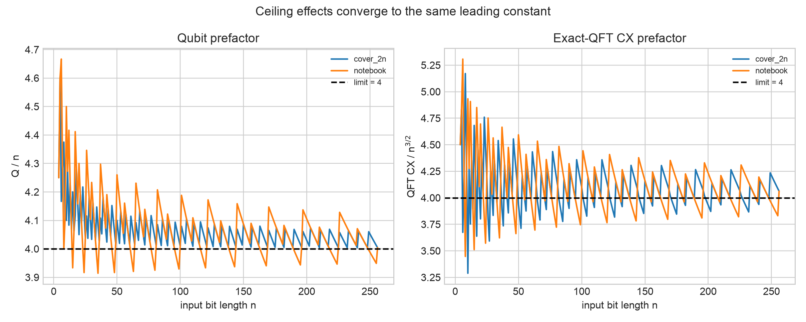
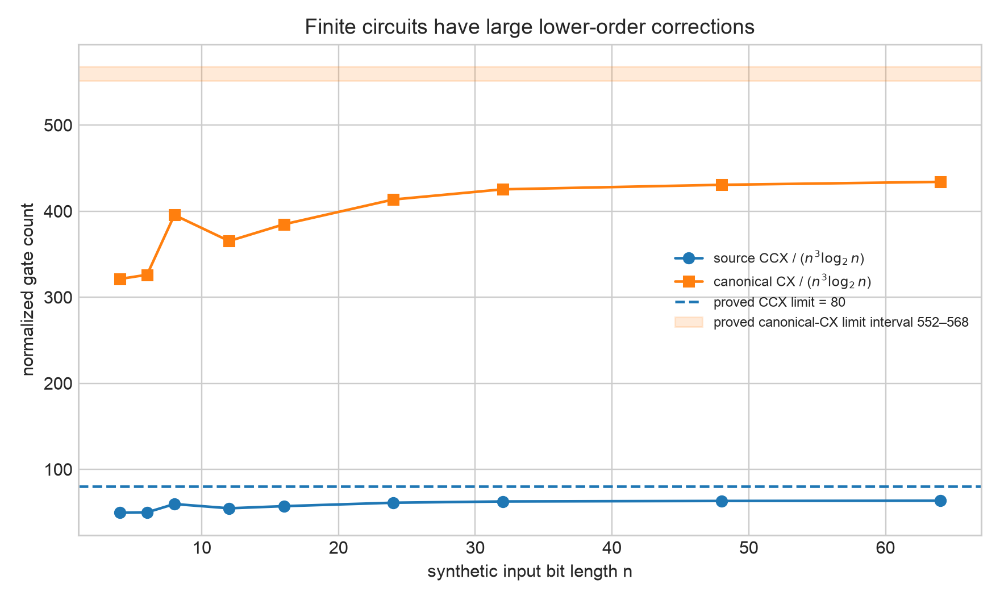
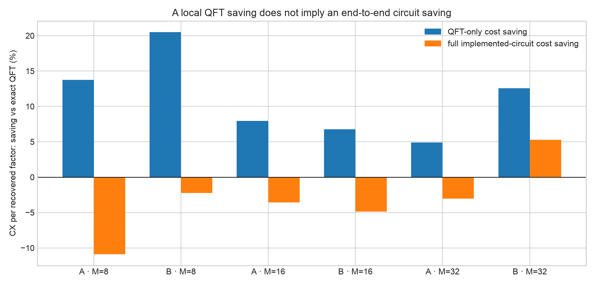
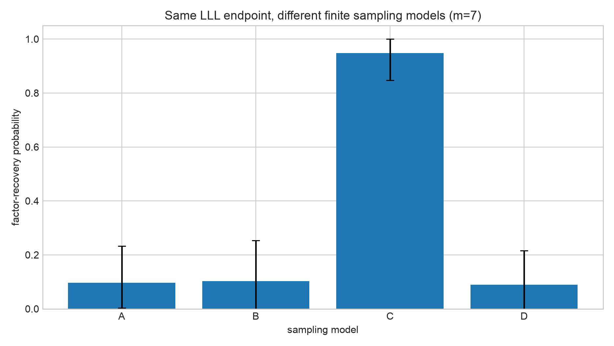

# Week 8: Circuit Constants, Asymptotic Complexity, and Simulator Comparison

## The result in plain language

This week turns the circuit diagrams into explicit formulas and counts every
arithmetic gate hidden inside the notebook's custom modular-exponentiation
blocks.  Under the notebook's parameter rule, the implemented circuit uses
about **4n qubits**, where `n` is the number of bits in the integer being
factored.  Its exact-QFT section uses about **2n^(3/2) controlled-phase gates**
or **4n^(3/2) CX gates** in the gate basis audited here.

The full circuit has a different scaling.  Because every exponent bit invokes
a serial, shared-workspace Häner-style controlled modular multiplication, the
implemented arithmetic uses

```text
80 n^3 log2(n) + O(n^3) source-level Toffoli gates.
```

With the exact primitive decompositions used in this audit, the leading CX
coefficient lies between **552 and 568**; the interval is caused by the binary
weights of the classical modular constants.  Therefore this notebook is a
low-width Regev-style sampler, but it is **not** a circuit realization of
Regev's claimed `O~(n^(3/2))` gate complexity.  The shared workspace saves
qubits while serializing much more arithmetic.

The held-out comparison also changes how the earlier approximate-QFT result
should be described.  Omitting one QFT layer lowered the *QFT-only* pooled CX
cost per recovered factor by **4.9% to 20.5%**, but the exact QFT represented at
most **0.0341%** of the recursively flattened finite circuit.  Once the full
arithmetic cost was charged, the saving did not persist consistently: five of
six point estimates were worse, and the one positive cell was caused mainly by
more successful Monte Carlo trials rather than by removing a material fraction
of the circuit.  The defensible finding is that **a local QFT gate saving is not
evidence of an end-to-end Regev circuit saving**.

## What was measured

Four quantities called a “circuit cost” are often mixed together.  They are
kept separate here:

1. **Qubits:** the maximum number of logical wires simultaneously present.
2. **Source gates:** `X`, `CX`, `CCX`, `CSWAP`, `H`, `CP`, `SWAP`, and
   measurement after recursively opening every imported arithmetic gate.
3. **Canonical CX count:** a transparent all-to-all basis conversion with
   `CCX -> 6 CX`, `CSWAP -> 8 CX`, `CP -> 2 CX`, and `SWAP -> 3 CX`.
4. **Physical cost:** routing, native-gate calibration, arbitrary-angle
   synthesis, error correction, and physical qubits.  This repository does
   **not** estimate this fourth quantity.

There is no hardware-independent single constant.  The constants reported
below are exact for the source architecture and the declared canonical basis,
not for an unspecified quantum computer.

## Exact parameter definitions

Let:

- `N` be the integer to factor;
- `n = N.bit_length()`;
- `d = ceil(sqrt(n))` be the number of exponent registers;
- `q` be the number of qubits in each exponent register;
- `M = 2^q` be the Fourier modulus.

The notebook's default `cover_2n` rule is

```text
q = ceil(2n / d).
```

Its alternative `notebook` rule is

```text
q = floor(n/d + d).
```

Both satisfy

```text
d = sqrt(n) + O(1),
q = 2 sqrt(n) + O(1),
dq = 2n + O(sqrt(n)).
```

The finite QFT experiments are different: they deliberately freeze `d=2`,
`q in {3,4,5}`, and `M in {8,16,32}`.  Those toy settings validate finite
behavior; they are not an asymptotic sequence.

## Deriving the qubit constant

The actual builder allocates:

```text
dq       exponent-register qubits
n        result-register qubits
n + 1    shared auxiliary/work qubits
```

Therefore

```text
Q(n) = dq + 2n + 1
     = 4n + O(sqrt(n)).
```

So the source circuit's qubit prefactor is

```text
lim Q(n)/n = 4.
```

This is a property of the notebook's **shared-workspace implementation**.  It
must not be substituted for the space constant of Regev's original circuit or
the Ragavan–Vaikuntanathan Fibonacci construction; those are different
arithmetic architectures.



## Deriving the exact QFT constant

For one `q`-qubit QFT register, the source code contains

```text
q(q - 1)/2 controlled-phase gates
floor(q/2) swaps.
```

For `d` independent registers,

```text
CP_QFT(d,q) = d q(q - 1)/2,
CX_QFT(d,q) = d[q(q - 1) + 3 floor(q/2)].
```

The second formula uses two CX gates per controlled phase and three per swap.
Substituting `d = sqrt(n) + O(1)` and `q = 2sqrt(n) + O(1)` gives

```text
CP_QFT(n) = 2 n^(3/2) + O(n),
CX_QFT(n) = 4 n^(3/2) + O(n).
```

The QFT constants are therefore exactly **2** at the controlled-phase level
and **4** at the declared CX level.

### What fixed-layer truncation changes

If `r` of the longest-range rotation layers are removed, the exact saving is

```text
saved CP = d r(r + 1)/2,
saved CX = d r(r + 1).
```

For fixed `r`, this is only `O(sqrt(n))`.  It does not change either QFT
leading constant, and it is even smaller relative to the full arithmetic:

```text
QFT relative saving  = O(1/n),
full-circuit relative saving = O(1/(n^(5/2) log n)).
```

To change the QFT leading constant, the number of omitted layers must itself
grow proportionally with `q`; that is a much stronger approximation and is not
supported by the present held-out endpoint evidence.

## Opening the arithmetic black box

The high-level Qiskit circuit initially displays one modular-exponentiation
box per dimension.  Counting those boxes as one gate would be misleading.  The
new counter recursively follows the actual imported code:

```text
modular exponentiation
  -> q controlled modular multiplications
     -> 2n double-controlled modular additions + n controlled swaps
        -> comparators + recursive controlled constant adders
```

Let `A(n)` be the number of source CCX gates in one recursive controlled
constant adder.  Directly from the code,

```text
A(n) = A(ceil(n/2)) + A(floor(n/2)) + 10n + O(1)
     = 10n log2(n) + O(n).
```

This gives the following chain:

```text
double-controlled modular addition = 20n log2(n) + O(n) CCX
controlled constant multiplication = 20n^2 log2(n) + O(n^2) CCX
controlled modular multiplication  = 40n^2 log2(n) + O(n^2) CCX
complete d-dimensional arithmetic  = 40dq n^2 log2(n) + O(dq n^2) CCX
                                   = 80n^3 log2(n) + O(n^3) CCX.
```

The source CNOT count inside the recursive adders depends on the popcounts of
the modular constants.  Bounding those data-dependent terms gives

```text
72 n^3 log2(n) <= native CX leading term <= 88 n^3 log2(n).
```

Since each source CCX contributes six CX gates in the declared basis,

```text
552 n^3 log2(n) <= canonical CX leading term
                  <= 568 n^3 log2(n),
```

up to `O(n^3)` corrections.  The shared arithmetic registers prevent the
`dq` controlled multiplications from running in parallel.  Using the
component-depth analysis of the Häner arithmetic gives an `O(n^3)` all-to-all
logical-depth bound for this serial composition, while the gate count itself
supplies the looser `O(n^3 log n)` bound.  An exact depth prefactor is
compiler- and connectivity-dependent and is not claimed here.

The tests compare the formulas with the imported Qiskit gate definitions and
also confirm the CX conversion by transpiling a complete controlled modular
multiplier at optimization level zero.  The finite ratios in the next plot sit
well below their limits because the `O(n^3)` corrections are still large at
`n <= 64`; the asymptotic constants come from the recurrence proof, not a
small-`n` curve fit.



## Endpoint-adjusted resource comparison

The eight frozen QFT holdouts were

```text
55, 65, 85, 95, 115, 119, 133, 161.
```

Every cell used roots `(2,3)`, circuit bases `(4,9)`, seven samples per
recovery attempt, 64 replicates per `N`, and the same augmented-lattice/LLL/
relation-verification/factor-extraction endpoint.  Factors were used only for
post-hoc success validation.

For each cell, the new metric is

```text
pooled CX per recovered factor
  = total CX spent across all held-out trial batches
    / number of successful factor recoveries.
```

This is a descriptive held-out cost ratio, not a hardware runtime estimate.

| Model | M | QFT-only saving from omitting one layer | Full-circuit saving | N-cluster bootstrap 95% interval for full saving |
|---|---:|---:|---:|---:|
| Uniform hard box | 8 | +13.7% | -10.9% | [-33.3%, +0.003%] |
| Finite Gaussian | 8 | +20.5% | -2.2% | [-21.0%, +15.4%] |
| Uniform hard box | 16 | +7.9% | -3.6% | [-7.5%, +0.002%] |
| Finite Gaussian | 16 | +6.8% | -4.9% | [-25.0%, +0.002%] |
| Uniform hard box | 32 | +4.9% | -3.0% | [-11.5%, +0.002%] |
| Finite Gaussian | 32 | +12.6% | +5.3% | [+0.001%, +14.3%] |

A positive number means fewer CX gates per observed recovery.  These intervals
resample `N`, the unit of generalization.  They do not justify a universal
benefit: the direct one-layer gate removal is less than 0.004% of the full
finite circuit, so full-cost changes are almost completely controlled by the
noisy recovery numerator rather than by a meaningful circuit-size reduction.



## Comparing the simulation models

The same phrase “Regev simulation” had been used for mathematically different
objects.  The Week 8 comparison fixes the standard LLL endpoint, `d=3`, and
`m=7`, then changes only the data generator on the 20 frozen quotient-study
semiprimes.

| Model | What it generates | Mean factor recovery across N | N-cluster bootstrap 95% interval |
|---|---|---:|---:|
| A | Exact finite uniform hard-box law | 9.69% | [0.31%, 23.28%] |
| B | Exact finite discrete-Gaussian amplitude law | 10.31% | [0%, 25.31%] |
| C | Synthetic noisy points near the theoretical dual lattice | 94.84% | [84.69%, 100%] |
| D | Model A plus 1% readout-bit flips and 5% whole-shot corruption | 8.91% | [0%, 21.56%] |

Model C is **not a circuit simulation**.  Its generator enumerates the modular
image, constructs the exact relation lattice by HNF, draws a dual coset, adds
bounded noise, and withholds that oracle from recovery.  Its much higher
success rate shows that the downstream LLL code works when its input satisfies
the theoretical noisy-dual premise; it does not show that the implemented
finite circuit produces such samples.  Models A and B are exact finite output
laws, while D is only a declared classical readout/corrupt-shot surrogate.



The classical algorithms used to produce these data also have different
complexities:

- The early dense fiber evaluator costs `O(F M^(2d))` time and
  `O(M^(2d) + F M^d)` memory for `F` arithmetic fibers.
- The later exact autocorrelation/FFT evaluator costs
  `O(d(2M-1)^d + M^d log(M^d))` time and `O((2M-1)^d + M^d)` memory.
- Model C first performs factor-blind Cayley-image enumeration and exact HNF;
  it is a synthetic oracle-side generator, not evidence of quantum runtime.
- A generic complete statevector simulation needs `Theta(2^Q)` amplitudes,
  with `Q=dq+2n+1`.

Simulator wall time therefore cannot be used as the circuit's quantum gate
complexity.  The simulators intentionally evaluate different mathematical
representations.

## Relation to the primary literature

[Regev's factoring algorithm](https://arxiv.org/abs/2308.06572) runs an
approximately `n^(3/2)`-gate quantum circuit about `sqrt(n)+4` times and then
uses polynomial-time lattice post-processing.  That asymptotic circuit relies
on a different arithmetic organization than the serial shared-workspace code
audited here.

[Ragavan and Vaikuntanathan](https://arxiv.org/abs/2310.00899) reduce Regev's
space using Fibonacci exponentiation while retaining `O(n^(3/2) log n)` gate
size, and their corruption filter modifies classical post-processing.  The
repository's QFT truncation and readout surrogate are not implementations of
that theorem.  [Ragavan's prefactor analysis](https://eprint.iacr.org/2024/636)
also shows why constants must be tied to a particular multiplication and space
architecture rather than to the word “Regev.”

The imported arithmetic is structurally related to the low-width,
Toffoli-based construction analyzed by
[Häner, Roetteler, and Svore](https://arxiv.org/abs/1611.07995), which likewise
has `O(n^3 log n)` size when used for repeated modular exponentiation.  The
`80` coefficient here is derived from the exact additionally controlled source
code in this repository; it is not copied from that paper.

Approximate QFTs have a long history, including
[Coppersmith's construction](https://arxiv.org/abs/quant-ph/0201067).  The
finite one- and two-layer experiment here is narrower: it studies a particular
gate deletion rule and a particular finite lattice endpoint.

## What is established, and what is not

### Established for this repository

- The source qubit constant is `4` under either supplied asymptotic parameter
  mode.
- The exact-QFT controlled-phase and canonical-CX constants are `2` and `4`.
- The recursively expanded arithmetic has leading source-CCX constant `80`
  and canonical-CX leading interval `[552,568]` under the declared basis.
- Fixed-layer QFT deletion cannot change these leading constants.
- In the frozen small experiments, QFT-only savings do not translate into a
  consistent full implemented-circuit saving.
- The four sampling models are empirically and computationally non-equivalent.

### Not established

- These are not physical-qubit, surface-code, T-count, or hardware-runtime
  constants.
- The counted circuit is not proven optimal; cross-block compiler
  optimization may change finite lower-order terms.
- The finite Gaussian experiment is not an asymptotic execution of Regev's
  full Gaussian-state algorithm.
- Model C's strong recovery is not evidence that a realizable circuit produces
  theorem-quality samples.
- Eight QFT holdouts and twenty sampler holdouts do not establish behavior for
  cryptographic-size semiprimes.
- No end-to-end advantage over Shor's algorithm, Regev's theoretical circuit,
  or the Ragavan–Vaikuntanathan circuit is claimed.

## Reproduce everything

From the repository root:

```bash
source .venv/bin/activate
MPLBACKEND=Agg MPLCONFIGDIR=/tmp/mpl python scripts/run_week8_complexity.py
python -m pytest tests/test_resource_analysis.py -q
```

The script does not refit or rerun the frozen quantum-sample trials.  It hashes
and reanalyzes their stored rows, performs a deterministic synthetic resource
sweep, and writes all Week 8 outputs to:

```text
all_graphics_and_results/results/week_8_complexity/
```

Important files:

- [`summary.json`](all_graphics_and_results/results/week_8_complexity/summary.json)
  — machine-readable findings and limitations.
- [`finite_full_circuit_resources.csv`](all_graphics_and_results/results/week_8_complexity/finite_full_circuit_resources.csv)
  — recursively flattened resources for every QFT holdout and cutoff.
- [`qft_endpoint_cost.csv`](all_graphics_and_results/results/week_8_complexity/qft_endpoint_cost.csv)
  — QFT-only and full-circuit cost per recovered factor.
- [`simulation_model_comparison.csv`](all_graphics_and_results/results/week_8_complexity/simulation_model_comparison.csv)
  — held-out A/B/C/D comparison at the same standard LLL endpoint.
- [`simulator_complexity.csv`](all_graphics_and_results/results/week_8_complexity/simulator_complexity.csv)
  — the computational contract of each simulator.
- [`resource_analysis.py`](regev_research/resource_analysis.py)
  — exact formulas and recursive arithmetic counter.
- [`test_resource_analysis.py`](tests/test_resource_analysis.py)
  — direct checks against the imported Qiskit gate definitions.

The configuration seed is `2026080101`.  Bootstrap intervals use 5,000
resamples at the `N` level.  The synthetic resource inputs follow
`N=2^(n-1)+1` only to obtain deterministic `n`-bit circuit constants; no
factoring outcome or factorization of those values is used.
