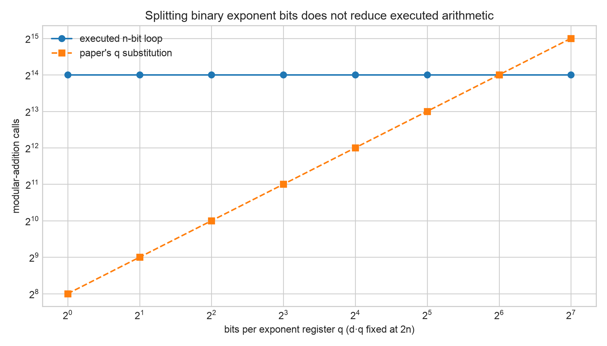
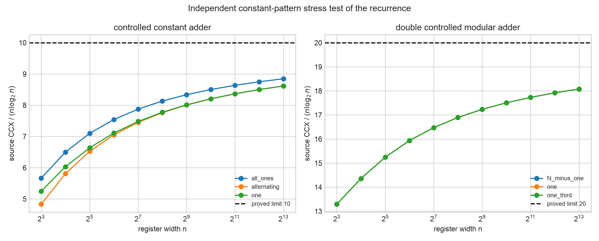
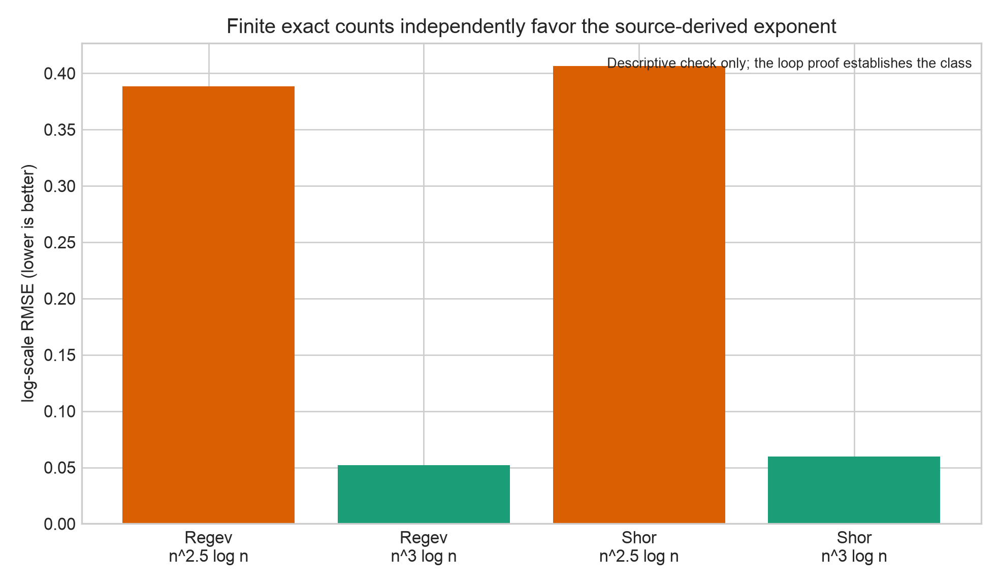
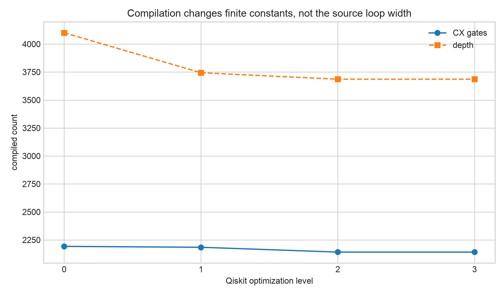

# Independent Complexity-Fidelity Validation

## TL;DR

This folder independently tests the discrepancy between the complexity stated
for the public Regev implementation and the arithmetic its source code actually
constructs.  The associated paper reports `O(n^(5/2) log n)`, but the frozen
source contains an inner loop over the full `n`-bit result register where the
paper's displayed calculation substitutes the shorter exponent-register width
`q`.  Static AST inspection, direct Qiskit gate expansion, exact recursive gate
counts, dimensional-splitting tests, compiler tests, and negative controls all
support `Theta(n^3 log n)` for this implementation.  The result is confirmed
for the frozen source files and hashes in this folder.  It is not a claim that
Regev's theoretical algorithm is wrong, and it should be presented to the
paper's authors as a reproducible discrepancy before being called a formally
accepted correction.

## Confidence and email decision

The paper-to-code comparison is now as strong as a source audit can make it:

| Question | Answer |
|---|---|
| Does the paper say it is analyzing “our implementation”? | Yes, in Section 2.2. |
| Does the paper identify the public code? | Yes, Code Availability links `Wlitkopa/regev-quantum-algorithm`. |
| Is that the repository audited here? | Yes; the vendored repository has the identical origin URL. |
| Could this be caused by later arithmetic changes? | The six audited files match their 2024 pre-publication revisions byte-for-byte. |
| Does the displayed paper count use `q` for the inner additions? | Yes. |
| Does the cited source use `n` there? | Yes, explicitly in `reversed(range(n))`. |
| Does that change the asymptotic class? | Yes, by the growing factor `n/q=Theta(sqrt(n))`. |

Therefore, **yes, this is substantial enough to email the authors about**.
Academic authors generally want to know about a specific, reproducible
discrepancy in their paper—especially one that changes an asymptotic exponent.
The message should be framed as a request for clarification, not an accusation.
A copy-ready draft is in
[`AUTHOR_CONTACT_DRAFT.md`](AUTHOR_CONTACT_DRAFT.md).

What “100%” means here must be stated precisely:

- **Exact for the cited frozen source model:** the loop count and resulting
  `Theta(n^3 log n)` source-gate class follow mechanically from the code.
- **Not yet author-confirmed:** the authors could reply that Section 2.2 was
  intended to analyze a different, unimplemented circuit or a different
  accounting convention.  The explicit Code Availability link makes that
  explanation less likely, but only the authors can clarify their intention.
- **Publication size:** the discrepancy alone is naturally a corrigendum or
  short technical note.  Combined with the complexity-fidelity certificate,
  matched Shor analysis, dimensional-invariance theorem, and reproducible
  tests, it can support a workshop or focused research paper.  It is not by
  itself a full refutation of Regev's algorithm.

## The exact issue

Let `n` be the bit length of the integer, `d` the number of Regev exponent
registers, and `q` the width of each exponent register.  The implementation
uses `dq = 2n + O(sqrt(n))` binary exponent controls.

The source call graph is:

```text
d modular exponentiation blocks
  × q controlled modular multiplications
    × 2 constant modular multipliers (forward and inverse)
      × n double-controlled modular additions
```

Therefore, the executed number of modular additions is

```text
2 d q n = 4n^2 + O(n^(3/2)).
```

The paper's displayed implementation calculation instead uses

```text
2 d q^2.
```

For Regev's `q = 2sqrt(n) + O(1)`, the missing ratio is

```text
(2dqn) / (2dq^2) = n/q = sqrt(n)/2 + O(1).
```

This factor grows with the input, so it changes the asymptotic exponent rather
than only changing a finite prefactor.

The exact source counter proves that one double-controlled modular addition
uses

```text
20n log2(n) + O(n) source CCX gates.
```

Consequently,

```text
[2dqn] [20n log2(n) + O(n)]
    = 80n^3 log2(n) + O(n^3) source CCX.
```

The paper used for comparison is [Pawlitko, Moćko, Niemiec, and Chołda,
*Implementation and Analysis of Regev's Quantum Factorization
Algorithm*](https://arxiv.org/html/2502.09772v2).  The theoretical target comes
from [Regev's factoring algorithm](https://arxiv.org/abs/2308.06572), whose
arithmetic architecture is different from the serial binary construction
tested here.

The paper-to-code claims are itemized in
[`paper_code_crosswalk.csv`](results/paper_code_crosswalk.csv), and the
pre-publication history audit is frozen in
[`paper_source_provenance.json`](results/paper_source_provenance.json).

## Independent tests

The new validation does not simply rerun the original formula.

### 1. AST source inspection

Python's syntax tree is inspected directly.  It finds:

| Source fact | Observed iterator |
|---|---|
| Shor exponent schedule | `range(2*n)` |
| Regev exponent schedule | `range(qd)` |
| Shor constant-multiplier inner loop | `reversed(range(n))` |
| Regev constant-multiplier inner loop | `reversed(range(n))` |
| Forward/inverse constant multipliers | two calls in both families |

All eight frozen structural checks pass.  See
[`source_structure_checks.csv`](results/source_structure_checks.csv).

### 2. Direct Qiskit expansion

The tests recursively open the actual imported Qiskit gates for several
moduli, bases, and exponent widths.  Both `gates.haner` and `gates.r_haner`
match the independent primitive counter exactly.  The test includes complete
Shor and Regev modular-exponentiation gates, not only the innermost adder.

### 3. Dimensional-splitting invariance

For every exact power-of-two split satisfying `dq=2n`, the experiment varies
`q` from one bit to `2n` bits and adjusts `d` correspondingly.  The executed
binary arithmetic remains exactly

```text
2dqn = 4n^2 modular additions.
```

The experiment covers `n={8,16,32,64,128,256,512,1024}`.  This rules out
ceiling effects or the particular choice `d=ceil(sqrt(n))` as the explanation.



This establishes a useful implementation principle:

> Merely distributing a fixed binary exponent schedule across more registers
> does not reduce modular arithmetic.  An asymptotic saving requires a
> different multi-product architecture, not only shorter visual registers.

### 4. Constant-pattern stress test

The recursive adder was tested through `n=8192` with one-bit, alternating-bit,
all-one, one-third-modulus, and near-modulus constants.  The normalized counts
move toward the proved constants `10` for the controlled constant adder and
`20` for the double-controlled modular adder.  This tests whether the leading
coefficient was an artifact of one specially convenient modular constant.



### 5. Finite exponent-model check

Exact full-circuit counts were generated for
`n={4,6,8,12,16,24,32,48,64}`.  After fitting only a prefactor, the log-scale
errors were:

| Circuit | `n^(5/2) log n` RMSE | `n^3 log n` RMSE |
|---|---:|---:|
| Regev | 0.3885 | **0.0521** |
| Shor | 0.4063 | **0.0598** |

This is a descriptive cross-check, not the mathematical proof.  The proof
comes from the nested loop contracts.



### 6. Compiler robustness

The same complete controlled modular multiplier was transpiled into
`rz/sx/x/cx` at Qiskit optimization levels 0–3:

| Optimization | CX | Depth |
|---:|---:|---:|
| 0 | 2,192 | 4,101 |
| 1 | 2,184 | 3,744 |
| 2 | 2,141 | 3,686 |
| 3 | 2,141 | 3,686 |

Compilation reduces finite constants, but this small test supplies no evidence
of cancellations that grow enough to remove the source-level loop factor.
Hardware routing and error correction remain outside the model.



## Negative controls

The study deliberately includes cases that should behave differently if the
mechanism is correct:

- Removing every controlled QFT phase changes the source CCX count by exactly
  zero.  The discrepancy is arithmetic, not Fourier precision.
- Hypothetically replacing the inner `n` loop with a `q` loop reproduces the
  paper's displayed arithmetic count.  The frozen source does not make that
  replacement.
- At `n=64`, the actual-to-hypothetical ratio is exactly `n/q=4`.
- Changing the dimensional split while holding `dq=2n` leaves the executed
  `4n^2` modular-addition count unchanged.

All controls are recorded in
[`negative_controls.csv`](results/negative_controls.csv).

## What would falsify or narrow the result?

The conclusion must be revisited if any of the following is established:

1. The associated paper intended to analyze a different circuit from the
   frozen public implementation.
2. The constant-multiplier inner loop is replaced by a genuine `q`-width or
   different multi-product construction.
3. A uniform compiler family is proved to cancel a growing fraction of the
   nested arithmetic, rather than merely improving finite constants.
4. The source files change; hashes are frozen in
   [`independent_validation_certificate.json`](results/independent_validation_certificate.json).

## Responsible claim

The evidence supports:

> We identified and independently reproduced an asymptotic-complexity
> discrepancy between the published analysis and the associated frozen
> implementation.  The source executes `Theta(n^3 log n)` arithmetic because
> every constant multiplier traverses the `n`-bit result register.

It does **not** support:

- “Regev's algorithm is wrong.”
- “Shor always beats Regev.”
- “The paper's experimental results are invalid.”
- “This is unconditionally the first observation in the literature.”
- “The canonical gate count is a physical hardware cost.”

The next scholarly step is independent review by the professor, followed by a
short technical note sent privately to the paper's corresponding author with
the frozen hashes, proof, and reproduction command.

## Reproduce

From the repository root:

```bash
source .venv/bin/activate
MPLBACKEND=Agg MPLCONFIGDIR=/tmp/mpl python complexity_fidelity_study/run_extended_validation.py
MPLBACKEND=Agg MPLCONFIGDIR=/tmp/mpl python -m pytest complexity_fidelity_study/test_isolated_study.py -q
```

Run every repository test with:

```bash
MPLBACKEND=Agg MPLCONFIGDIR=/tmp/mpl python -m pytest -q
```

The study is deterministic.  Synthetic integers use
`N=2^(n-1)+1` only to generate `n`-bit modular constants; their factors are
never computed.  The transpiler seed is `2026080102`.

## Folder map

```text
complexity_fidelity_study/
├── README.md
├── AUTHOR_CONTACT_DRAFT.md
├── audit.py
├── run_extended_validation.py
├── test_isolated_study.py
└── results/
    ├── independent_validation_certificate.json
    ├── source_structure_checks.csv
    ├── dimension_split_invariance.csv
    ├── recurrence_convergence.csv
    ├── exact_scaling.csv
    ├── fixed_exponent_fits.csv
    ├── transpiler_robustness.csv
    ├── negative_controls.csv
    ├── paper_code_crosswalk.csv
    ├── paper_source_provenance.json
    ├── four reproducible PNG figures
    └── completion.json
```
