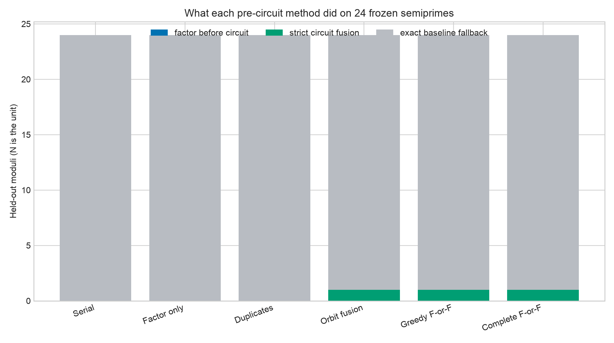
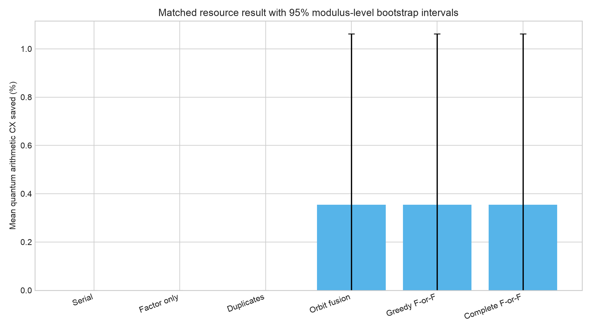
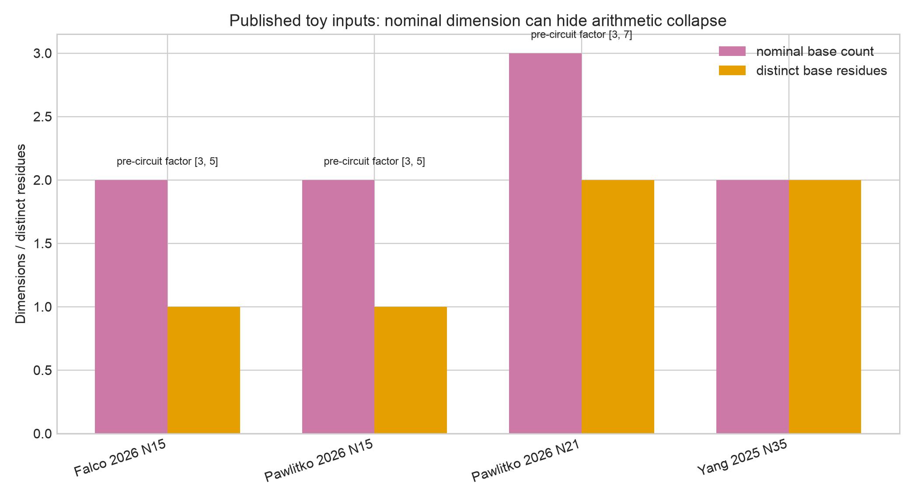
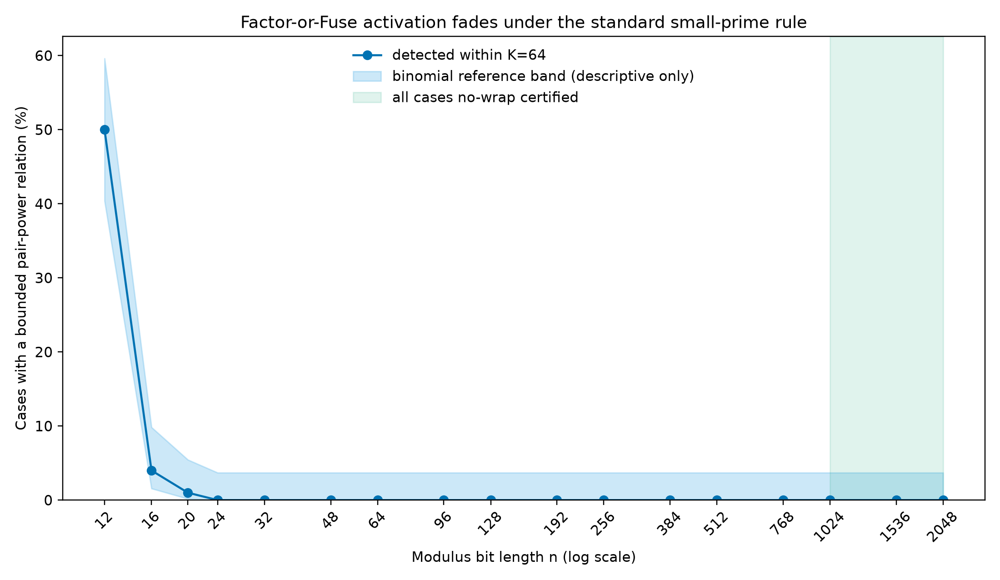

# Factor-or-Fuse

## Root-provenance audits for Regev-style factoring circuits

**TL;DR, part 1.** This folder implements a pre-circuit algorithm for
Regev-style factoring that inspects public dependencies among the modular
bases while permanently retaining the particular roots that generated them.
For every bounded dependency it finds, the algorithm does something useful:
it either extracts a classical factor immediately or certifies an `L0`
dependency that may be fused into a cheaper but exactly equivalent arithmetic
oracle.

**TL;DR, part 2.** The audit exposes a serious toy-benchmark confound.  A
published `N=15` Regev input uses the integer bases `4` and `49`, which are the
same residue modulo 15; its nominally two-dimensional arithmetic map is really
one-dimensional, and the stored roots `2` and `7` give the factors `3` and `5`
before a quantum circuit is needed.  The related first-coprime-prime-square
rule produces the same collision for `N=15` and `N=21`.

**TL;DR, part 3.** The hoped-for broad speedup did **not** survive a frozen
held-out test.  Only 1 of 24 unseen semiprimes admitted a profitable `L0`
fusion, none was classically factored by the bounded scan, and mean quantum
arithmetic saving was `0.354%` with a 95% modulus-bootstrap interval of
`[0%, 1.062%]`; the preregistered hypothesis failed.  A separate descriptive
census found bounded relations in 50% of 12-bit cases, 4% at 16 bits, 1% at
20 bits, and 0% in every tested stratum from 24 through 2048 bits.  The result
therefore matters as a benchmark-integrity check and exact compiler rule, not
as a scalable replacement for Regev's algorithm.

---

## The idea in very simple words

Regev's factoring circuit gives several number registers to a modular
arithmetic box.  The box is supposed to use several bases, such as

```text
a1^x1 * a2^x2 * ... * ad^xd  (mod N).
```

Sometimes two advertised bases are secretly powers of each other modulo `N`.
That creates a fork:

```text
public base dependency
          |
          v
compare the specifically chosen roots
          |
     +----+----+
     |         |
     v         v
nontrivial   only +1/-1
sqrt of 1   at root level
     |         |
     v         v
factor N     fuse arithmetic
now          exactly, if cheaper
```

The important detail is that the roots cannot be thrown away.  The same
squared base can come from inequivalent roots, and that difference may be the
factor certificate.

## Why this is different from the earlier paper-error result

The repository's earlier complexity-fidelity audit showed that a supplied
implementation used a serial arithmetic architecture whose exact complexity
did not match a displayed asymptotic claim.  That is background evidence.

This study adds an intervention:

1. a factor-free-input dependency detector;
2. exact root-aware classification;
3. a factor-first, all-witness policy;
4. a reversible orbit-fusion compiler;
5. exact no-regression resource planning;
6. a benchmark-integrity audit;
7. a frozen 24-modulus evaluation and a 1,700-modulus descriptive census.

It is still not honest to call the underlying square-root identity new.  The
potential contribution is the integrated preprocessor/compiler and the
benchmark finding.

---

## Exact mathematical objects

Let `N > 2` be odd and composite.  Store an ordered family of units

\[
B=(b_1,\ldots,b_d)\in((\mathbb Z/N\mathbb Z)^*)^d
\]

and define the circuit bases by

\[
a_i=b_i^2\pmod N,
\qquad
A=(a_1,\ldots,a_d).
\]

The implementation uses immutable `(b_i,a_i)` pairs.  It never reconstructs
an arbitrary square root from `a_i`.

Define the two homomorphisms

\[
h_A(z)=\prod_{i=1}^d a_i^{z_i}\pmod N,
\qquad
\beta_B(z)=\prod_{i=1}^d b_i^{z_i}\pmod N.
\]

The relation lattice and its non-factor-yielding sublattice are

\[
L=\ker h_A
=\left\{z\in\mathbb Z^d:\prod_i a_i^{z_i}=1\pmod N\right\},
\]

\[
L_0
=\left\{z\in L:\beta_B(z)\in\{+1,-1\}\pmod N\right\}.
\]

A vector in `L0` is valid but directly useless for the final GCD step.  A
vector in `L \ L0` produces a nontrivial square root of one and therefore a
proper factor.  The factor-bearing information is the quotient `L/L0`.

## Research question and frozen hypothesis

**Question.** Can bounded public power dependencies among the notebook's
selected bases be converted into either an immediate factor or a strictly
cheaper exact arithmetic oracle, without known factors or group orders?

**Frozen hypothesis.** On 24 untouched semiprimes, at least 6 would be
actionable and the 95% modulus-level bootstrap lower bound on mean canonical-CX
saving would be positive.

**Answer.** No.  The complete method was actionable for only `1/24`; the
bootstrap lower bound was exactly zero.  The broad performance hypothesis was
rejected.

---

## The Factor-or-Fuse algorithm

The final recommended variant keeps **all** witnesses in the public bound.
This matters because the first exponent reaching a target can lie in `L0`
while a later exponent yields a factor.

```text
FACTOR-OR-FUSE(N, stored pairs (bi, ai), exponent width q, bound K)

1. For each anchor i:
     walk ai, ai^2, ..., ai^K modulo N.

2. Every time ai^k = aj for j != i:
     z <- k*ei - ej
     verify product_l al^z_l = 1 mod N
     R <- product_l bl^z_l mod N
     verify R^2 = 1 mod N

3. If any R is not +1 or -1:
     return gcd(R-1,N) or gcd(R+1,N)
     do not build the quantum circuit.

4. Otherwise every detected relation is in L0.
     Give the least L0 exponent for each ordered pair to the fusion planner.

5. Enumerate certified orbit covers and include the exact reversible
   accumulator cost.  Select a fusion only if it is strictly cheaper than
   the serial baseline; otherwise return the baseline unchanged.
```

No function in this path accepts `p`, `q`, `phi(N)`, `lambda(N)`, a group
order, a planted relation, or an arbitrary modular square root.

### Why all witnesses matter

The post-holdout red-team census found

```text
N = 3277 = 29 * 113
roots = [2, 3, 5, 7]
bases = [4, 9, 25, 49]
```

For the ordered pair `9 -> 49`:

- `k=8` is an `L0` witness;
- `k=64` is factor-yielding and returns `(29,113)`.

A least-witness-only policy misses that factor.  The all-witness variant adds
no extra modular-power steps—it retains all hits encountered during the same
length-`K` walk—but can perform more root classifications and GCDs.  On the
original 24 held-out moduli, this change did not alter any outcome: the result
remained 0 factors, 1 fusion, and 23 fallbacks.

---

## Theorem 1: factor-or-fuse dichotomy

Suppose public arithmetic proves

\[
a_j=a_i^k\pmod N
\]

for distinct indices `i,j`.  Let

\[
z_0=e_j-k e_i,
\qquad
r=b_jb_i^{-k}\pmod N.
\]

Then:

1. `z0` is in `L`;
2. `r^2 = 1 mod N`;
3. if `r` is not `+1` or `-1`, the GCDs of `r-1` and `r+1` with `N` are
   proper divisors;
4. if `r` is `+1` or `-1`, then `z0` is in `L0` and the dependency is safe
   for quotient-preserving elimination.

### Proof, line by line

From the public power relation,

\[
h_A(z_0)=a_ja_i^{-k}=1\pmod N,
\]

so `z0` belongs to `L`.  At the root level,

\[
r^2
=b_j^2b_i^{-2k}
=a_ja_i^{-k}
=1\pmod N.
\]

Therefore `N` divides `(r-1)(r+1)`.  Set

\[
g_-=\gcd(r-1,N).
\]

If `g_-=1`, Euclid's lemma implies that `N` divides `r+1`, so
`r=-1 mod N`.  If `g_-=N`, then `r=+1 mod N`.  Excluding those two values
forces

\[
1<g_-<N.
\]

The same argument applies to `gcd(r+1,N)`.  For an odd squarefree semiprime,
the two GCDs are the two prime factors in some order.  For a general odd
composite, they are proper complementary divisors, not necessarily primes.

This is the classic congruent-squares/nontrivial-square-root factoring
mechanism, not new number theory.

## Theorem 2: exact preservation of the factor-bearing quotient

Assume the second branch, `r=+1` or `r=-1`.  Delete coordinate `j` and define

\[
(Tz)_i=z_i+kz_j,
\]

with every other surviving coordinate unchanged.  Then

\[
h_A(z)=h_{\widetilde A}(Tz)
\]

for every integer vector `z`.  The kernel of `T` is generated by the primitive
relation `e_j-k e_i`, which lies in `L0`.  Moreover,

\[
\beta_B(z)=r^{z_j}\beta_{\widetilde B}(Tz).
\]

Because `r` is only a sign,

\[
z\in L_0
\quad\Longleftrightarrow\quad
Tz\in\widetilde L_0.
\]

Hence `T` induces the exact isomorphism

\[
\boxed{L/L_0\cong\widetilde L/\widetilde L_0.}
\]

For a group of several targets around one anchor, the kernel is generated by
all `e_j-k_j e_i`, and the same proof applies.

This theorem preserves factor-bearing **classes**.  It does not promise to
preserve Euclidean norms, LLL conditioning, Gaussian widths, Fourier-sample
geometry, or recovery probability.

## Theorem 3: narrow no-wrap limitation

Let the retained roots be distinct ordinary primes and search only positive
exponents `1 <= k <= K`.  If

\[
\max_i b_i^{2K}<N,
\]

then no cross-base relation `a_j=a_i^k mod N` can occur within the bound.

Why?  Both positive integers `b_i^(2k)` and `b_j^2` are then strictly between
zero and `N`.  Congruence modulo `N` would imply equality as ordinary
integers, but unique prime factorization forbids

\[
b_i^{2k}=b_j^2
\]

for distinct primes.

If the roots are polynomial in the bit length `n=ceil(log2 N)`, the bounded
pass is therefore asymptotically inactive for
`K=o(n/log n)`.  This limitation applies only to this positive pair-power
detector.  It says nothing about arbitrary multidimensional relations,
negative powers, growing-`K` searches, or other Regev arithmetic designs.

---

## Exact reversible fusion

For a certified orbit group with anchor `g` and

\[
a_i=g^{k_i}\pmod N,
\]

the direct oracle action

\[
\prod_i a_i^{x_i}
\]

equals

\[
g^s,
\qquad
s=\sum_i k_ix_i.
\]

The compiler:

1. keeps every original exponent/QFT register;
2. allocates a clean integer accumulator;
3. reversibly computes the full ordinary integer `s`;
4. applies one existing modular-exponentiation block controlled by `s`;
5. reverses the adders and restores accumulator/carry to zero.

It never reduces `s` modulo `2^q`.  For unsigned `q`-bit exponents, the exact
maximum and sufficient accumulator width are

\[
S_{\max}=(2^q-1)\sum_i k_i,
\qquad
t=\operatorname{bit\_length}(S_{\max}).
\]

Thus every partial sum is below `2^t`, so the reversible adders never wrap.

### Resource objective

The planner uses the repository's exact source primitives and frozen
all-to-all canonical-CX map:

- `CX -> 1 CX`;
- `CCX -> 6 CX`;
- `CSWAP -> 8 CX`;
- `CP -> 2 CX`;
- `SWAP -> 3 CX`.

This is a reproducible logical cost, not a physical-qubit, routing,
fault-tolerance, or hardware-runtime estimate.  Singleton baseline groups are
always candidates.  Therefore the planner cannot regress its declared cost
objective, although it can trade gates for extra clean qubits.

---

## Frozen held-out experiment

The protocol and case list were hashed before any held-out execution:

- protocol: `factor-or-fuse-holdout-v1`;
- 24 moduli: first 24 lexicographic products of distinct primes in `[163,211]`;
- `N`, not shot batches, is the generalization unit;
- 15/16-bit moduli, all with `d=4`, `q=8`;
- roots from the first four coprime primes: `[2,3,5,7]`;
- bases `[4,9,25,49]`;
- public bound `K=64`, chosen during older development and never retuned;
- no exclusions;
- factor manifest isolated and loaded only after raw method rows were written
  and hashed;
- 5,000 modulus-level bootstrap resamples, seed `2026080102`.

The exact list, seeds, hash values, stopping rules, and factor firewall are in
[`PROTOCOL.md`](PROTOCOL.md), [`freeze.py`](freeze.py), and
[`FROZEN_PROTOCOL.sha256`](FROZEN_PROTOCOL.sha256).

### Six controlled arms

| Arm | Factor scan | Fusion | Planner |
|---|---:|---:|---|
| Serial baseline | no | no | serial |
| Factor only, K=64 | yes | no | serial fallback |
| Duplicate fusion only | no | `k=1` only | exact |
| Root-blind orbit fusion | no | any first hit | exact |
| Greedy Factor-or-Fuse | yes | L0 only | greedy |
| Complete Factor-or-Fuse | yes | L0 only | exact set partition |

### Held-out outcome

| Metric | Result |
|---|---:|
| Moduli | 24 |
| Pre-circuit factors | 0 |
| Strictly cheaper L0 fusions | 1 |
| Exact baseline fallbacks | 23 |
| Actionable rate | 4.17% |
| Wilson interval for actionable rate | 0.74% to 20.24% |
| Mean canonical-CX saving | 0.354% |
| Median saving | 0% |
| 95% N-bootstrap interval for mean | 0% to 1.062% |
| Certificate failures | 0 |
| Preregistered hypothesis | **failed** |

The duplicate-only arm did nothing on all 24 inputs.  Root-blind orbit fusion,
greedy Factor-or-Fuse, and exact Factor-or-Fuse selected the same one case.
The factor-only arm found no factor.

### The one successful fusion

For

\[
N=35237=167\cdot211
\]

the method received only `N` and selected roots `[2,3,5,7]`.  It found

\[
4^{27}=25\pmod{35237},
\]

with relation vector

\[
(27,0,-1,0).
\]

The stored-root product was `35236 = -1 mod N`, so the relation lies in `L0`
and revealed no factor.  The compiler combined the first and third exponent
coordinates, used a 13-qubit accumulator plus one carry qubit, and produced:

| Resource | Serial | Fused | Change |
|---|---:|---:|---:|
| Canonical CX | 6,320,402 | 5,783,248 | -537,154 (-8.50%) |
| Full-width multiplier calls | 32 | 29 | -3 |
| Extra clean qubits | 0 | 14 | +14 |

The algebraic plan was reverified, and 290 deterministic/adversarial exponent
vectors agreed exactly with the direct oracle.  The proof comes from the
congruence and no-overflow inequalities; random checks are bug-finding support,
not the proof.





---

## Published toy-benchmark audit

### `N=15`: nominal dimension 2, arithmetic dimension 1

The `N=15` experimental input in Falcó et al. uses `a1=4` and `a2=49`.
Modulo 15,

\[
49=4,
\]

so

\[
h(x_1,x_2)=4^{x_1+x_2}\pmod{15}.
\]

The nominal two-coordinate map depends on only one integer combination.  The
short relation `(1,-1)` has norm `sqrt(2)`.  With the generating roots `2` and
`7`,

\[
R=2\cdot7^{-1}=11\pmod{15},
\qquad
11^2=1\pmod{15},
\]

but `11` is neither `1` nor `14`.  Therefore

\[
\gcd(11-1,15)=5,
\qquad
\gcd(11+1,15)=3.
\]

The circuit's raw hardware measurements remain measurements of the circuit
that was run.  What changes is the interpretation: it is a rank-collapsed
instance with a planted shortest useful relation, not a representative
independent two-dimensional Regev instance.

### First-coprime-prime-square implementation rule

The Pawlitko et al. implementation scans prime roots, skips roots dividing
`N`, and appends their ordinary squares.  Its source even prints a discovered
factor while skipping such a root.  Ignoring that explicit setup leak:

- `N=15` retains roots `[2,7]`, again giving bases `[4,49]` and factor `(3,5)`;
- `N=21` retains roots `[2,5,11]`, giving residues `[4,4,16]`; roots `2` and
  `5` already give factor `(3,7)`.

This is a concrete mechanism that can make the smallest recovery benchmarks
unusually easy.  It does not prove that every result in either paper is wrong,
and it does not invalidate Regev's asymptotic algorithm.



---

## Post-holdout scaling census

After the primary result was sealed, a separate deterministic descriptive
census evaluated 100 semiprimes at each of 17 bit lengths.

| Bit length | Any K=64 relation | Least-witness factors | All-witness factors | L0-only |
|---:|---:|---:|---:|---:|
| 12 | 50/100 | 28 | 29 | 22 under least-hit policy |
| 16 | 4/100 | 2 | 2 | 2 |
| 20 | 1/100 | 0 | 0 | 1 |
| 24–768 | 0/1,200 | 0 | 0 | 0 |
| 1024–2048 | 0/300 | 0 | 0 | 0; all no-wrap certified |

These are deterministic panel proportions, not estimates from an independent
random sample.  Cases inside a bit-length stratum reuse some generated prime
factors, so the plotted binomial band is only a descriptive reference and must
not be treated as inferential evidence.

The census supports a narrow mechanism claim: fixed-`K` pair-power activation
is common in very small wraparound-dominated examples and rapidly disappears
under this structured small-prime rule.  It does not rule out larger `K`,
different roots, negative powers, general short multiplicative relations, or
different compilers.



---

## What is and is not novel

### Not novel

- Regev's definitions of selected roots, squared bases, `L`, and `L0`;
- extracting a factor from a nontrivial square root of one;
- the classical Rabin/congruent-squares reduction;
- rewriting products when generators are known powers of a common base;
- simultaneous exponentiation, windowing, Pippenger/Straus methods;
- the observation that multiplicative dependencies can reduce effective
  dimension;
- Regev/Ragavan–Vaikuntanathan lattice recovery or corruption filtering.

### Potentially original, pending broader peer review

After a focused primary-literature audit, we did not locate the complete
combination of:

1. bounded public dependency discovery before circuit construction;
2. classification with the specifically retained roots;
3. factor-first handling of **all** bounded witnesses;
4. signed `L0` certification;
5. an exact `L/L0` preservation certificate;
6. reversible integer exponent aggregation with cleanup;
7. exact-cost no-regression fallback;
8. an audit demonstrating rank-collapsed, pre-factorable published toy inputs.

An unsuccessful keyword search is not a novelty proof.  The responsible claim
is “we are not aware of this integrated rule after the documented audit,” not
“the first ever.”

---

## Three claims to quote accurately

### 1. Verified implementation contribution

> We implemented a factor-free-input, stored-root-aware Factor-or-Fuse
> preprocessor.  Every retained bounded witness is verified in `L`, classified
> at the root level, and converted into either a proper factor, an exact
> quotient-preserving `L0` fusion, or the unchanged serial baseline.

### 2. Verified empirical benchmark result

> Published `N=15` prime-square inputs can collapse a nominally
> two-dimensional Regev arithmetic map to one dimension and expose the factors
> through a norm-`sqrt(2)` public relation before the quantum circuit runs.

### 3. Verified limitation; unverified broader hypothesis

> At frozen `K=64`, the intended broad resource improvement failed on the
> 24-modulus holdout, and bounded activation vanished from 24 bits onward in a
> deterministic scaling panel.  Whether richer dependency classes can support
> a useful scalable Regev compiler remains unverified.

Do not describe this as a breakthrough, a scalable factoring speedup, or a
replacement for Regev's post-processing.

---

## Reproduce everything

From the repository root:

```bash
source .venv/bin/activate
export MPLBACKEND=Agg
export MPLCONFIGDIR=/tmp/mpl
```

Run focused correctness tests:

```bash
python -m pytest tests/test_orbit_fusion.py -q
```

Re-run the frozen primary experiment:

```bash
python -m factor_or_fuse_study.run_study
```

Re-run the all-witness held-out sensitivity check:

```bash
python -m factor_or_fuse_study.run_all_witness_sensitivity
```

Re-run the post-holdout scaling census:

```bash
python -m factor_or_fuse_study.run_scaling_census
```

Primary outputs:

- [`heldout_per_arm.csv`](results/heldout_per_arm.csv): every modulus and arm;
- [`heldout_arm_summary.csv`](results/heldout_arm_summary.csv): N-level summary;
- [`raw_method_rows.json`](results/raw_method_rows.json): outputs sealed before
  factor-manifest loading;
- [`summary.json`](results/summary.json): protocol hashes and final decision;
- [`published_benchmark_audit.csv`](results/published_benchmark_audit.csv);
- [`all_witness_heldout_sensitivity.csv`](results/all_witness_heldout_sensitivity.csv);
- [`scaling_census/per_modulus.csv`](results/scaling_census/per_modulus.csv).

## Code map

- [`regev_research/orbit_fusion.py`](../regev_research/orbit_fusion.py):
  classifier, least/all-witness scans, Factor-or-Fuse, exact planner, circuit
  builder, certificates, and resource records;
- [`tests/test_orbit_fusion.py`](../tests/test_orbit_fusion.py): exhaustive tiny
  oracle cleanup/equivalence, exact gate expansion, fallback, tamper rejection,
  quotient preservation, all-witness regression, and no-wrap tests;
- [`run_study.py`](run_study.py): frozen six-arm evaluation and graphics;
- [`run_scaling_census.py`](run_scaling_census.py): descriptive scaling study;
- [`run_all_witness_sensitivity.py`](run_all_witness_sensitivity.py): post-hoc
  robustness check;
- [`factor_manifest.py`](factor_manifest.py): isolated post-hoc factors.

## Remaining limitations

1. The detector searches directed positive pair powers only, not arbitrary
   multidimensional relations.
2. `K=64` is finite and incomplete.  Unrestricted search can become a
   discrete-log problem.
3. Fusion preserves the arithmetic oracle and `L/L0`; it does not prove better
   Fourier samples or lattice recovery.
4. The selected logical resource model is not a hardware cost model.
5. The only held-out fusion saved gates by using 14 extra clean qubits.
6. The exact set-partition planner is intended for small dimension; the module
   uses deterministic greedy grouping above its declared exact limit.
7. The scaling census is post hoc and deterministic, with within-stratum factor
   reuse; it cannot rescue the failed primary hypothesis.
8. The literature audit is focused, not an exhaustive priority proof.

## Primary literature

- O. Regev, [*An Efficient Quantum Factoring Algorithm*](https://arxiv.org/abs/2308.06572), 2023.
- S. Ragavan and V. Vaikuntanathan, [*Space-Efficient and Noise-Robust Quantum Factoring*](https://arxiv.org/abs/2310.00899), CRYPTO 2024.
- M. O. Rabin, [*Digitalized Signatures and Public-Key Functions as Intractable as Factorization*](https://publications.csail.mit.edu/lcs/pubs/pdf/MIT-LCS-TR-212.pdf), MIT/LCS/TR-212, 1979.
- M. Ekerå and J. Gärtner, [*Extending Regev's Factoring Algorithm to Compute Discrete Logarithms*](https://arxiv.org/abs/2311.05545), 2023.
- C. Pilatte, [*Unconditional Correctness of Recent Quantum Algorithms for Factoring and Computing Discrete Logarithms*](https://arxiv.org/abs/2404.16450), 2024.
- P. Pawlitko et al., [*Implementation and Analysis of Regev's Quantum Factorization Algorithm*](https://reference-global.com/download/article/10.2478/qic-2026-0012.pdf), *Quantum Information & Computation* 26, 2026.
- D. Falcó et al., [*From Period Finding to Lattice Sampling: Experimental Insights into Shor's and Regev's Factoring Algorithms*](https://arxiv.org/abs/2606.17647), 2026.
- W. Yang et al., [*Space-Optimized and Experimental Implementations of Regev's Quantum Factoring Algorithm*](https://arxiv.org/abs/2511.18198), 2025.

